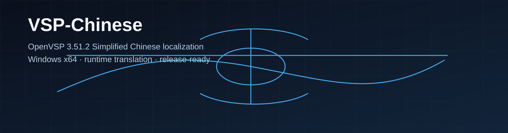

# OpenVSP-Chinese



[](source/OpenVSP/LICENSE)
[](#)
[](docs/RELEASE_CHECKLIST.md)

OpenVSP 3.51.2 简体中文汉化版，面向 Windows x64。

这是基于 [OpenVSP](https://github.com/OpenVSP/OpenVSP) 的中文本地化发布仓库，包含运行时翻译、Windows 构建脚本和发布说明。

## 下载

- 运行包下载：GitHub Releases
- 源码下载：对应 tag 的源码归档
- 发布说明：`docs/RELEASE_TEMPLATE.md`
- 发布检查：`docs/RELEASE_CHECKLIST.md`

## 一眼看懂

- 基于 OpenVSP 3.51.2
- 运行时加载 `translations/zh-CN.json`
- 支持 Windows 目录式发布
- 适合 GUI 汉化和二次开发
- 仓库主页展示横幅：`docs/images/banner.svg`

## 发布内容

每个发布包应包含：

- 完整运行目录
- `LICENSE`
- `NOTICE.md`
- `translations/zh-CN.json`

## 快速开始

1. 下载 GitHub Releases 中的完整运行包
2. 解压后直接运行 `vsp.exe` 或 `vspviewer.exe`
3. 保持 `translations\zh-CN.json` 与可执行文件同级或位于 `translations\` 目录下

## 项目结构

```text
VSP-Chinese/
├─ source/OpenVSP/       OpenVSP 源码及汉化改动
├─ translations/         简体中文 GUI 词典
├─ tools/                字符串扫描与翻译审计
├─ docs/                 构建、修改和发布说明
├─ build-windows.ps1     Windows 一键构建脚本
├─ LICENSE               许可证说明
├─ NOTICE.md             上游来源和修改声明
└─ README.md
```

## 开发者入口

继续扩展汉化时，先看这两个文件：

- `source/OpenVSP/src/gui_and_draw/Localization.cpp`
- `source/OpenVSP/src/vsp_aero/Viewer/ViewerLocalization.C`

完整变更地图见 `docs/MODIFICATIONS.md`。

## 构建

需要：

- Visual Studio Build Tools 2022
- MSVC v143
- Windows SDK
- CMake

```powershell
Set-ExecutionPolicy -Scope Process Bypass
.\build-windows.ps1
```

构建细节见 `docs/WINDOWS_BUILD.md`。

## 翻译审计

```powershell
python .\tools\audit_gui_translation.py
python -m json.tool .\translations\zh-CN.json > $null
```

当前审计目标是 `untranslated GUI literals: 0`。

## 许可与来源

源码基于 [OpenVSP](https://github.com/OpenVSP/OpenVSP)。OpenVSP 及本项目再分发内容遵循 NASA Open Source Agreement 1.3，完整文本见 `source/OpenVSP/LICENSE`。

修改来源、范围和发布要求见 `NOTICE.md` 与 `docs/MODIFICATIONS.md`。

## 维护者

- [WishYu-aero](https://github.com/WishYu-aero)
